  

## Hey, I'm Syed Anas

CS student at SSUET. i build in the cloud. i design interfaces. i write YouTube scripts.
[Portfolio](https://syedanas807.github.io/Portfolio-of-SyedAnas/) · [LinkedIn](https://linkedin.com/in/syed-anas-b189b33b7)

---

  
  
  
  
  
  
  

## What I'm building

| Project | What it does |
| --- | --- |
| [server-health-command-center](https://github.com/SyedAnas807/server-health-command-center) | Python dashboard for keeping an eye on server health |
| [receipt-ripper](https://github.com/SyedAnas807/receipt-ripper) | Pulls the useful data out of receipts |
| [Daily-task-assistant-Agent](https://github.com/SyedAnas807/Daily-task-assistant-Agent) | AI agent that helps plan the day |
| [Cellz-solution-calling-Agent](https://github.com/SyedAnas807/Cellz-solution-calling-Agent) | Voice calling agent |

---

  

